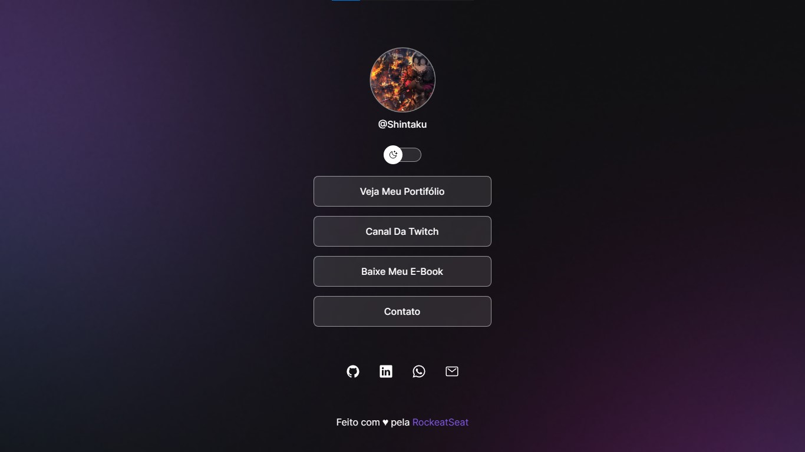

<h1 align="center">Projeto Social Tree - DevLinks </h1>

  <a href="#-tecnologias">Tecnologias</a>&nbsp;&nbsp;&nbsp;|&nbsp;&nbsp;&nbsp;
  <a href="#-layout">Layout</a>&nbsp;&nbsp;&nbsp;|&nbsp;&nbsp;&nbsp;
  <a href="#memo-licença">Licença</a>

  

 

> O DevLinks é um agregador de links para usar como cartão de visitas online. `Testar aqui:` <a href="https://projeto-social-tree.vercel.app/" target="_blank">https://projeto-social-tree.vercel.app/</a> 

## 🚀 Tecnologias

  
  
  
  
  
  
  
  

 
## 🔖 Layout
Você pode visualizar o layout do projeto através [DESSE LINK](https://www.figma.com/community/file/1187422022288947321). É necessário ter conta no [Figma](https://figma.com) para acessá-lo.

## :memo: Licença
Esse projeto está sob a licença MIT.
